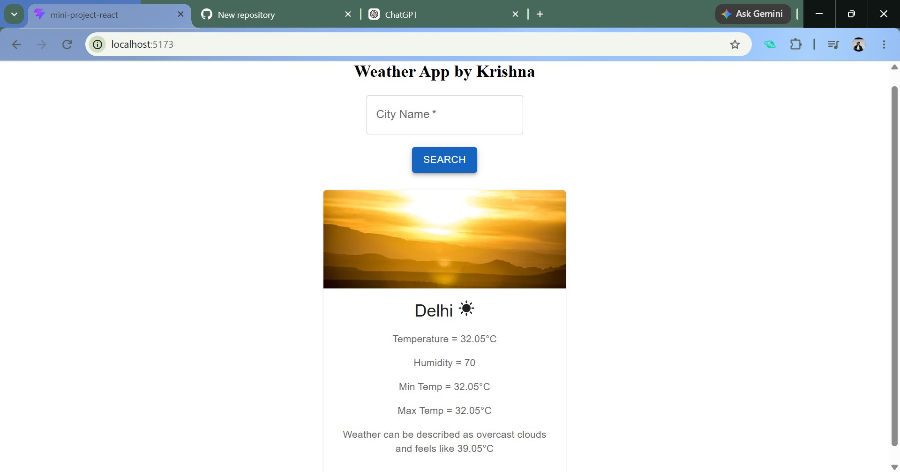
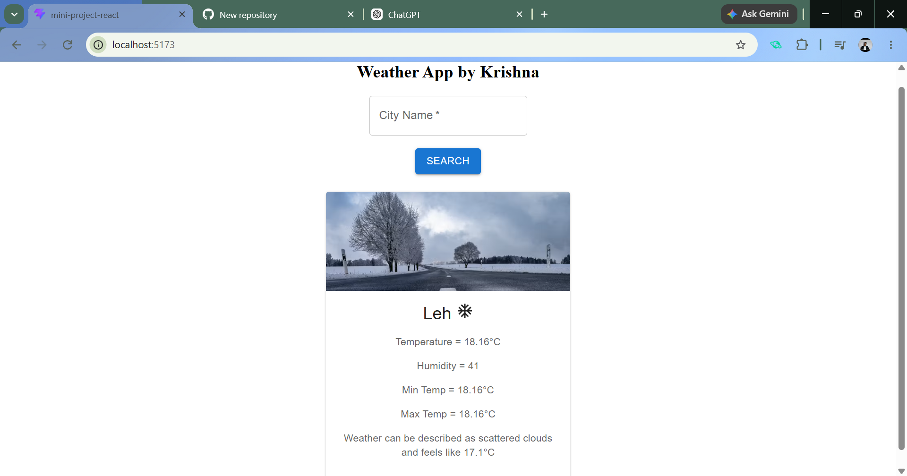
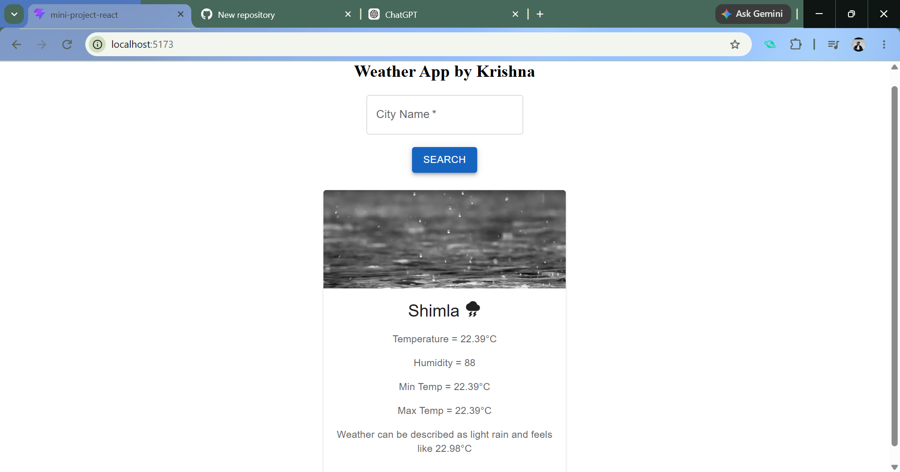
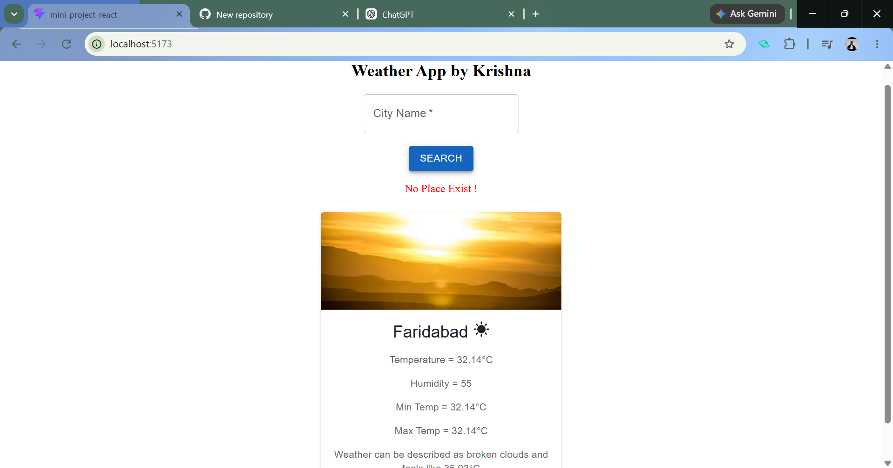

# Weather App

A simple weather application built with React that allows users to search for a city and view its current weather information. The application uses a weather API to retrieve real-time data and presents it through a clean and responsive interface.

## Features

* Search weather information by city name
* Display current temperature and feels-like temperature
* Show minimum and maximum temperature
* Display humidity and weather conditions
* Dynamic images based on weather conditions
* Responsive user interface

## Screenshots

### Home Page



### Cold Weather



### Rainy Weather



### Location Not Found



## Technologies Used

* React.js
* JavaScript
* HTML
* CSS
* Material UI
* Weather API

## Getting Started

Clone the repository and install the required dependencies:

```bash
git clone https://github.com/v-Krishna06/weatherApp-react.git
cd weatherApp-react
npm install
```

Start the development server:

```bash
npm run dev
```

The application will then be available on the local development server.

## Project Overview

This project was developed to practice React fundamentals, API integration, state management, component-based development, and responsive UI design.

## Author

**Krishna Kumar Verma**


